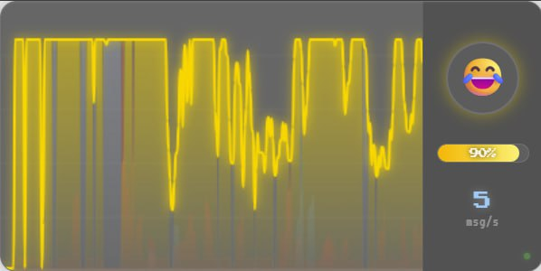

# 🎭 Chat Mood Meter

即時聊天情緒熱力儀表板 + 自動高光標記系統

把觀眾的情緒「看得見」——在直播畫面上即時顯示情緒波形，並自動標記精華時段。


<p align="center">
  
</p>

## ✨ 功能

- **即時情緒分析** — 153 個 emote/關鍵詞映射，涵蓋歐美 Twitch、台灣中文、日文、Unicode emoji
- **OBS Overlay** — 像素風 Canvas 波形圖 + 情緒 HUD，直接當 Browser Source 使用
- **自動高光標記** — 偵測情緒峰值，自動在 OBS 打時間戳
- **資料儲存** — SQLite 逐秒記錄情緒曲線
- **多格式導出** — JSON / CSV / HTML 報告，方便事後剪片或分析

## 📦 安裝

```bash
git clone https://github.com/aki-terminal-leaf/chat-mood-meter.git
cd chat-mood-meter
npm install
```

## 🚀 快速開始

### 1. 取得 Twitch OAuth Token

到 https://twitchapps.com/tmi/ 產生一組 token（格式：`oauth:xxxxxxxx`）。

### 2. 設定頻道

編輯 `config/default.json`：

```json
{
  "platforms": {
    "twitch": {
      "enabled": true,
      "channel": "你的頻道名稱",
      "token": "oauth:你的token"
    }
  }
}
```

### 3. 啟動

```bash
npm run dev
```

看到以下輸出就成功了：

```
[Main] chat-mood-meter 啟動中...
[Server] 啟動於 http://localhost:9800
[Main] Collector 已連線
[Main] 全部模組啟動完成。
[Main] Overlay: http://localhost:9800/
```

### 4. 加到 OBS

1. OBS → 來源 → **瀏覽器**
2. URL：`http://localhost:9800/`
3. 寬度：`400`　高度：`200`
4. 勾選「關閉來源時關閉 OBS」（可選）
5. 把它拖到畫面角落

## ⚙️ 設定說明

`config/default.json` 完整設定：

```jsonc
{
  "platforms": {
    "twitch": {
      "enabled": true,
      "channel": "",        // Twitch 頻道名稱（小寫）
      "token": ""           // OAuth token（oauth:xxx）
    },
    "youtube": {
      "enabled": false,
      "liveChatId": "",     // YouTube Live Chat ID
      "apiKey": ""          // YouTube Data API Key
    }
  },
  "analyzer": {
    "mode": "rules",        // "rules"（本地規則）或 "llm"（未來）
    "snapshotIntervalMs": 1000  // 情緒快照頻率（毫秒）
  },
  "highlight": {
    "windowSec": 30,           // 偵測視窗（秒）
    "densityMultiplier": 2.5,  // 訊息密度倍率門檻
    "intensityThreshold": 0.8, // 情緒強度門檻（0-1）
    "cooldownSec": 60          // 同類高光冷卻（秒）
  },
  "overlay": {
    "port": 9800,              // HTTP + WebSocket 埠
    "historyMinutes": 5        // 波形圖顯示多少分鐘
  },
  "obs": {
    "enabled": false,          // 是否連接 OBS WebSocket
    "host": "localhost",
    "port": 4455,              // OBS WebSocket 埠
    "password": ""             // OBS WebSocket 密碼
  },
  "storage": {
    "dbPath": "./data/sessions.db"
  }
}
```

## 🎯 接 Twitch 測試

### 方法一：用自己的頻道

1. 設定 `channel` 為你的 Twitch 帳號名稱（小寫）
2. 設定 `token`（從 https://twitchapps.com/tmi/ 取得）
3. 啟動後，開一個分頁到你的 Twitch 聊天室打幾句話
4. 觀察 terminal 輸出和 overlay 波形變化

### 方法二：接別人的直播（只讀）

Twitch IRC 允許匿名唯讀連線：

```json
{
  "twitch": {
    "enabled": true,
    "channel": "任何正在直播的頻道名",
    "token": ""
  }
}
```

Token 留空時會嘗試匿名連線（`justinfan` 模式），可以讀取任何公開頻道的聊天。

### 方法三：搭配 OBS 時間戳

1. OBS → 工具 → WebSocket 伺服器設定
2. 啟用 WebSocket 伺服器（預設 port 4455）
3. 設定密碼（或不設密碼）
4. 在 `config/default.json` 啟用：

```json
{
  "obs": {
    "enabled": true,
    "host": "localhost",
    "port": 4455,
    "password": "你的密碼"
  }
}
```

高光觸發時會自動在 OBS 錄影中建立 Chapter Marker。

## 📊 導出報告

直播結束後，資料會自動存在 `data/sessions.db`。

程式化導出（在程式碼中呼叫）：

```typescript
import { SessionDB, ExportManager } from './src/storage/index.js';

const db = new SessionDB('./data/sessions.db');
const exporter = new ExportManager(db);

// 列出所有場次
const sessions = db.listSessions();

// 導出最新一場
const latest = sessions[0];
await exporter.exportJSON(latest.session_id);   // → data/exports/xxx.json
await exporter.exportCSV(latest.session_id);    // → data/exports/xxx.csv
await exporter.exportHTML(latest.session_id);   // → data/exports/xxx.html
```

### HTML 報告

獨立的深色主題網頁，包含：
- 情緒時間軸折線圖（Chart.js）
- 高光標記垂直線
- 場次摘要卡片
- 高光清單（含代表性訊息）

直接開啟 `data/exports/xxx.html` 即可查看，也可以分享給別人。

## 🏗️ 架構

```
Twitch IRC ─→ Collector ─→ Analyzer ─→ Server ─→ Overlay (OBS)
                                      ↘ Highlight ─→ OBS Marker
                                      ↘ Storage ─→ Export
```

| 模組 | 說明 |
|------|------|
| `src/collector/` | Twitch IRC 訊息收集（tmi.js） |
| `src/analyzer/` | 規則引擎情緒分析 + 153 個 emote 映射 |
| `src/highlight/` | 高光偵測 + OBS WebSocket 時間戳 |
| `src/storage/` | SQLite 儲存 + JSON/CSV/HTML 導出 |
| `src/server.ts` | HTTP 靜態服務 + WebSocket 推送 |
| `overlay/` | OBS Browser Source 前端 |

## 🎨 情緒分類

| 情緒 | 顏色 | Emoji | 觸發範例 |
|------|------|-------|----------|
| Hype | 🟠 橘紅 | 🔥 | PogChamp, 好耶, 神, 8888 |
| Funny | 🟡 黃色 | 😂 | LUL, 笑死, 草, www |
| Sad | 🔵 藍色 | 😢 | BibleThump, QQ, 嗚嗚, 泣 |
| Angry | 🔴 紅色 | 😡 | 暴怒, 幹, NotLikeThis |
| Neutral | ⚪ 灰色 | 😐 | 一般對話 |

## 📝 開發

```bash
# 開發模式（hot reload）
npm run dev

# 建置
npm run build

# 啟動
npm start
```

## 📜 License

MIT

---

Made with 🍂 by [aki-terminal-leaf](https://github.com/aki-terminal-leaf)
